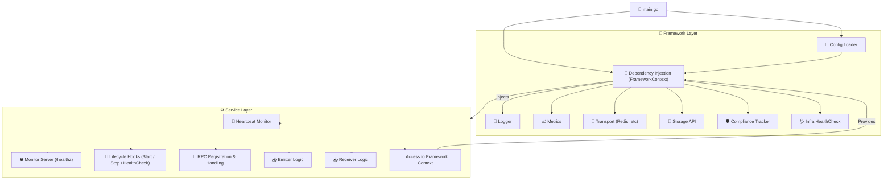
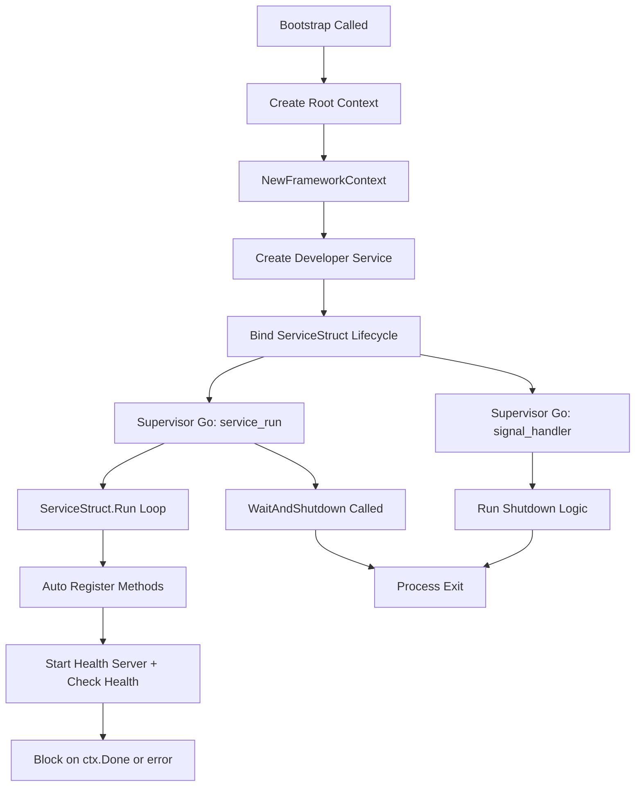
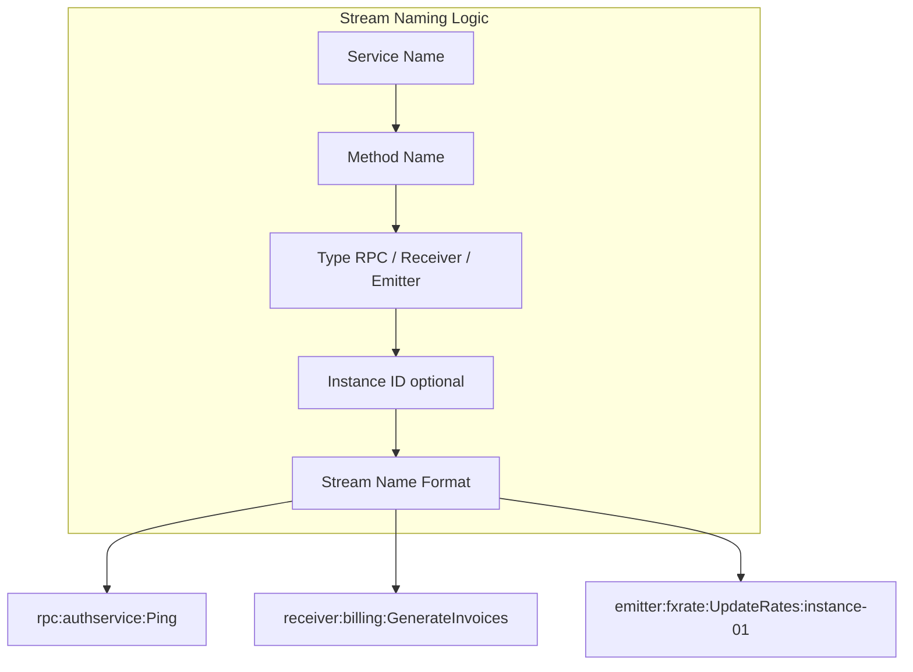
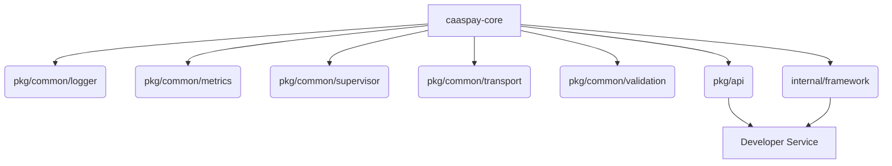
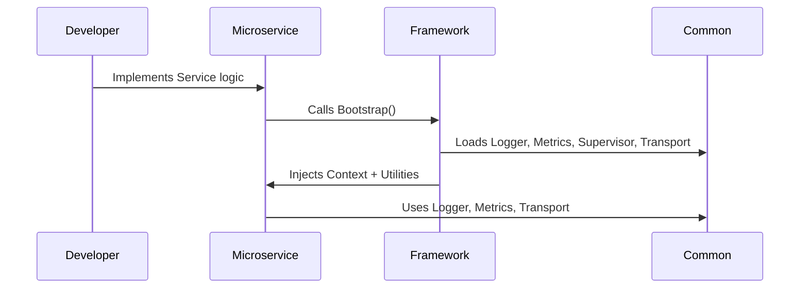
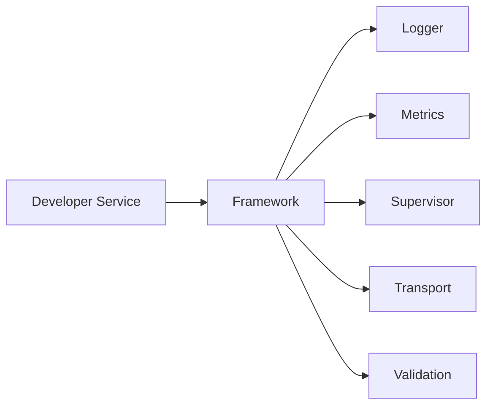
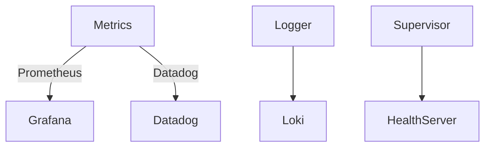

# Framework Architecture



### Framework Lifecycle



### Redis Stream Naming



# CAASPay Core Framework — Developer Guide

This document describes the high-level structure of the CAASPay microservices framework, its core packages, and how they interrelate.

---

## 🎯 Overview

- **Purpose**: Provide reusable, compliant, production-grade building blocks for:
  - Microservices (`caaspay-core`)
  - API gateway (`caaspay-api`)
  - Shared components (Logging, Metrics, Supervisor, Transport)

---

## 📁 Packages and Ownership

### Package Hierarchy



- **pkg/common** — Reusable implementations for Logging, Metrics, Supervisor, Transport, Validation.
- **pkg/api** — Shared interfaces, context keys, types.
- **internal/framework** — Bootstraps framework using common packages.

---

## 📌 Main Flow



---

## ✅ Design Rules

1. **No cyclic imports** — Common code never imports `api`, only `api` references `common`.
2. **Single source of truth for Context Keys** — All keys live in `pkg/api`.
3. **Unified config** — Config struct in `pkg/api/config.go` holds all nested parts for Logging, Transport, etc.

---

## 📂 Package Breakdown

| Package | Purpose |
| --- | --- |
| `pkg/common/logger` | Logging core (context-aware handler, interfaces) |
| `pkg/common/metrics` | Metrics abstraction (Prometheus, DataDog) |
| `pkg/common/supervisor` | Goroutine manager (health, auto shutdown) |
| `pkg/common/transport` | Redis Streams Transport |
| `pkg/common/validation` | Input struct validator |
| `pkg/api` | Interfaces, context keys, stream types |
| `internal/framework` | Service runtime, lifecycle, health checks |

---

## 🚀 Developer Implementation

- Developer service only imports: `pkg/api` + uses `framework.Bootstrap()`
- Implements:
  - RPC handlers
  - Emitters
  - Receivers



---

## 📈 Observability



---

## 🔐 Compliance & Security

- PCI-DSS friendly
- AES-GCM encryption in Transport
- Supports DLQs and retries

---

## 📄 Example Config

```yaml
framework:
  service_name: payment-service
  logging:
    level: INFO
    redact_sensitive: true
  transport:
    redis_addr: redis:6379
    use_encryption: true
    encryption_key: examplekey
```

---

## 📣 Contact

- Maintainer: <core@caaspay.com>
- Next step: Upgrade to full C4 model with Structurizr
