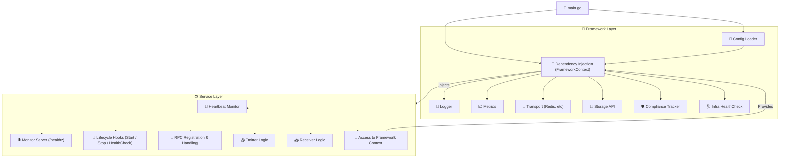

# Framework Architecture

```mermaid
graph TD

subgraph Framework_Layer ["🧱 Framework Layer"]
  Cfg["🧩 Config Loader"]
  DI["🧠 Dependency Injection (FrameworkContext)"]
  Logger["📜 Logger"]
  Metrics["📈 Metrics"]
  Transport["📡 Transport (Redis, etc)"]
  Storage["💾 Storage API"]
  Compliance["🛡️ Compliance Tracker"]
  InfraHealth["🩺 Infra HealthCheck"]
end

subgraph Service_Layer ["⚙️ Service Layer"]
  Heartbeat["💓 Heartbeat Monitor"]
  HealthServer["🌐 Monitor Server (/healthz)"]
  Lifecycle["🔁 Lifecycle Hooks (Start / Stop / HealthCheck)"]
  RPC["📨 RPC Registration & Handling"]
  Emitters["📤 Emitter Logic"]
  Receivers["📥 Receiver Logic"]
  UseCTX["🧭 Access to Framework Context"]
end

MainApp["🚀 main.go"] --> Cfg
MainApp --> DI

Cfg --> DI
DI -->|Injects| Logger
DI --> Metrics
DI --> Transport
DI --> Storage
DI --> Compliance
DI --> InfraHealth

DI --> Service_Layer
Service_Layer --> Heartbeat
Service_Layer --> HealthServer
Service_Layer --> Lifecycle
Service_Layer --> RPC
Service_Layer --> Emitters
Service_Layer --> Receivers
Service_Layer --> UseCTX
UseCTX -->|Provides| DI
```
